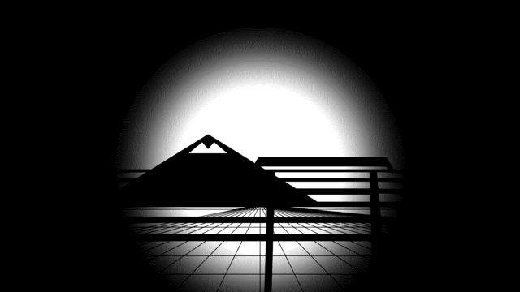

# Neo Tokyo 1bit

A strict 1-bit (black and white) [Omarchy](https://omarchy.org/) theme with
a 1980s Tokyo vibe -- dithered nighttime cityscapes instead of photos, and
a UI palette that never uses more than two colors.



## Install

```bash
omarchy theme install https://github.com/mojeska/omarchy-neo-tokyo-1bit.git
omarchy theme set "Neo Tokyo 1bit"
```

## What's in it

- **`colors.toml`** -- every UI role (background, foreground, accent,
  selection) is exactly `#000000` or `#ffffff`. No third color, no
  in-between grays.
- **`backgrounds/`** -- three original dithered scenes, procedurally
  generated (no photos), cycle with `omarchy theme bg next`:
  1. `1-shinjuku-sunrise.png` -- a striped retro sun rising behind a city
     skyline and a Tokyo-Tower-style spire, halftone-dithered.
  2. `2-neon-alley.png` -- a signage alley lit with real kanji (夜・光・酒・
     夢・恋・雨・猫・電), reflected in a hazy wet-pavement smear below.
  3. `3-fuji-torii.png` -- Mount Fuji and a torii gate against the same
     retro sun, over a synthwave perspective grid.

  All three are genuinely 2-color images -- dithering (not gradients or
  extra shades) is what implies depth and light.

## The one restrained exception

The UI chrome (bar, panels, background/foreground/accent/selection) stays
strictly black and white. The terminal's ANSI palette bends the rule in
exactly one place: `red`/`bright_red` and `green`/`bright_green` are real
colors (`#ff2d2d`/`#ff5555` and `#00e676`/`#33ff8c`), because they're the
two roles with the most everyday payoff -- `git diff` additions/removals,
test pass/fail, error output. Every other terminal color (yellow, orange,
cyan, blue, magenta, brown) stays white. It reads like a single deliberate
color pop against an otherwise monochrome frame, not a full palette.

## Regenerating the backgrounds

The three background images were built with ImageMagick shape/text drawing
plus a final dither pass (`-dither FloydSteinberg -colors 2` or
`-ordered-dither o8x8`) -- no photos, no AI image generation, no external
assets. There's no build script checked in; if you want to tweak them,
regenerate with ImageMagick 7 (`magick`) using similar layered
draw-then-dither steps, keeping every output strictly 2-color
(`magick <file> -format '%k colors' info:` should always print `2 colors`).
